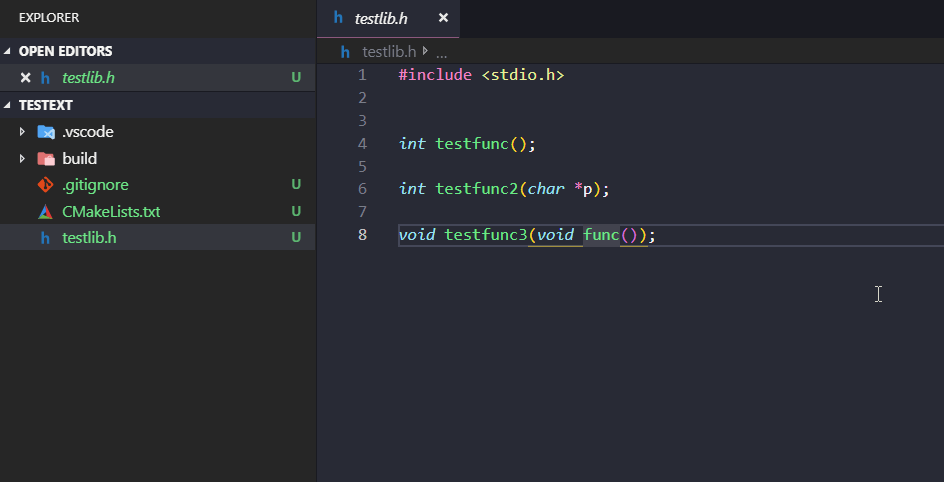
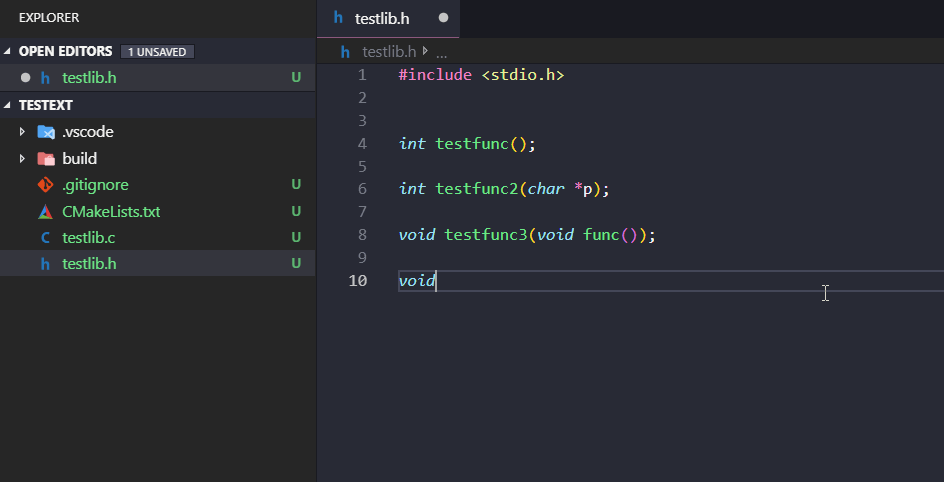
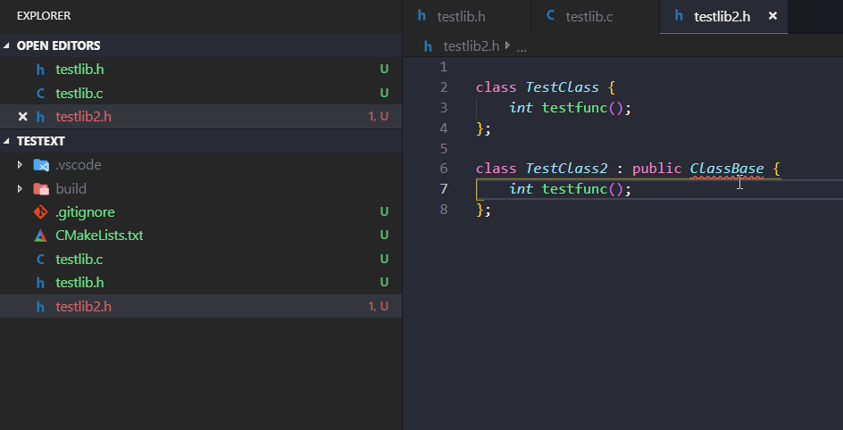

# generate c/cpp definition.

1. generate definitions from a header file.

2. generate definition declaration in current position.

3. generate c++ definition

## Issues
### Report any issues [here](https://github.com/reignofwebber/vscode-c-cpp-definition-generator/issues)
